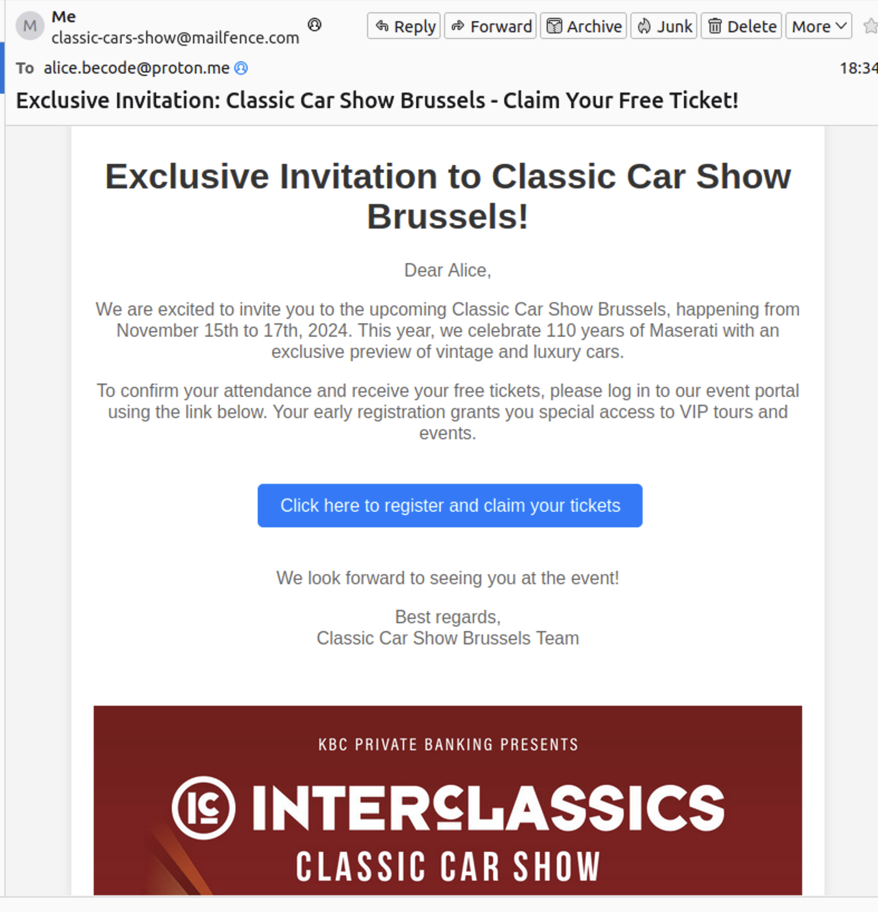
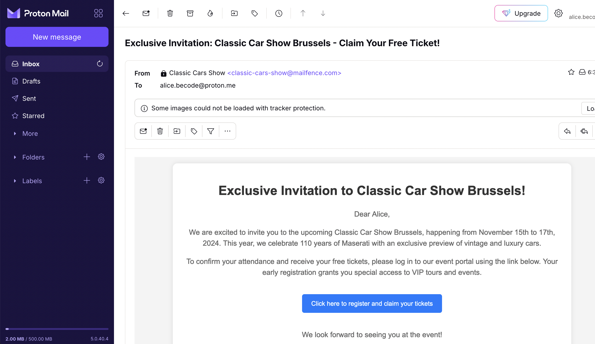
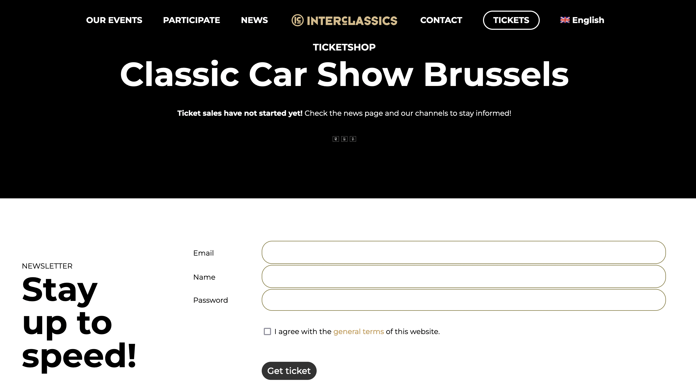
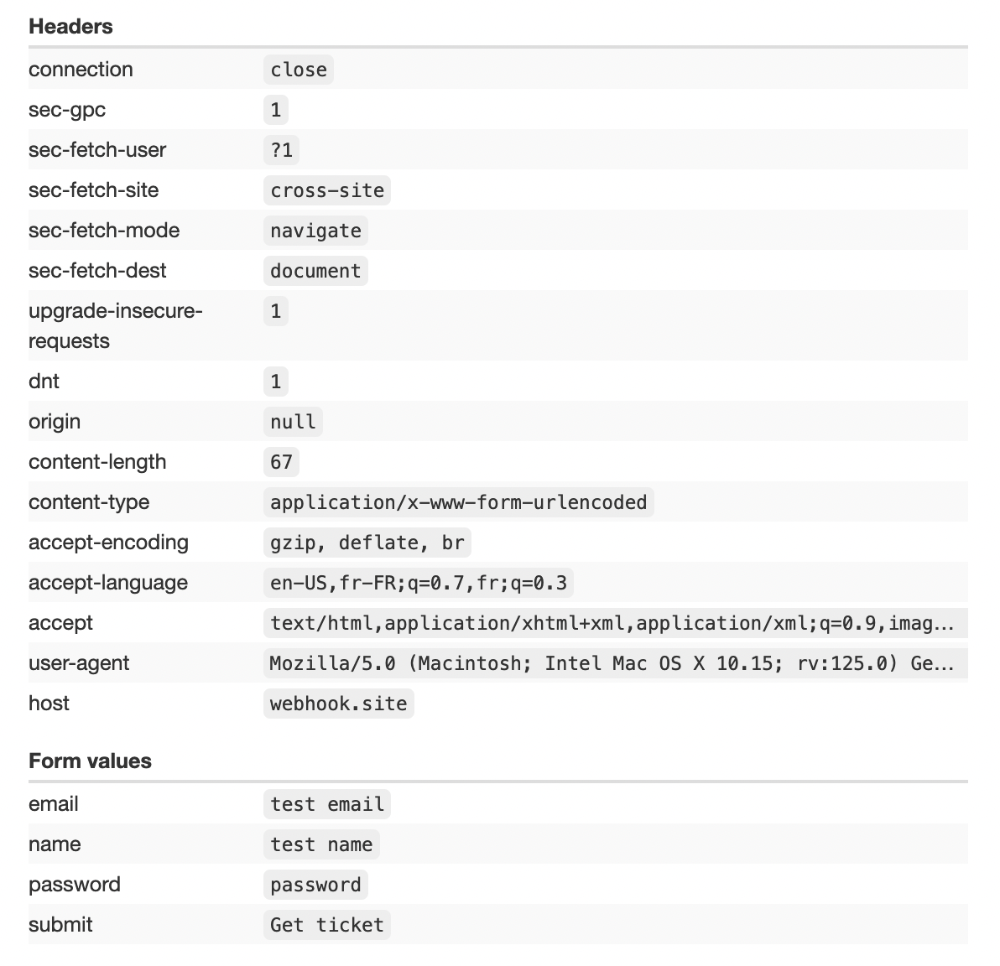

# Phishing project

In order to understand how phishing works 
How to make a really good phishing email and how to steal credentials

## Understand the Target
To craft an effective phishing email, we need to understand our target. For this exercise, the target is Alice, who has an interest in vintage cars.

We will send her an email about a vintage car show. Our inspiration is this site https://interclassics.events/en/classic-car-show-brussels/

## Creating the email

The subject line should grab Alice’s attention so she can't resist opening the email.
The email body will include a call to action that prompts Alice to click a link that will redirect her to our fake login form.

Subject: "Exclusive Invitation: Classic Car Show Brussels - Claim Your Free Ticket!"
From: classic-cars-show@someprovider.com (ideally we would have something like info@classiccarshows.com but come on)
To: alice@something.me

  

## Set up fake site with form

I'll set up a site with a login form where Alice, the target, will enter her credentials.
I'll keep the site local because I have the flemme of hosting it (and I left a lot of links to the real site I copy in the page).
Here I copied the event site without changing too much because I'm tired.

### Monitor requests

Let's go to [webhook](https://webhook.site) to get a unique URL and an email address.
We will use those to capture and view the incoming HTTP requests.

URL: `https://webhook.site/15ce126e-0fd1-4da0-b2d4-9b94f652919d`

The login form action attribute as a link to our webhook.

Now if / when Alice enters her credentials we'll have access to them in webhook.

